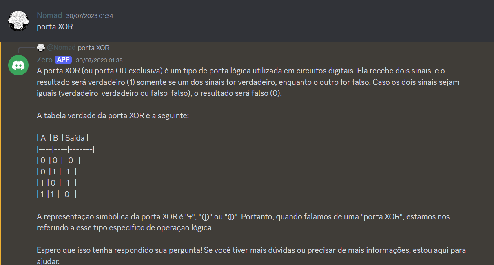

# Projeto de Integração com a API do ChatGPT no app Discord

Este projeto tem como objetivo demonstrar a integração da API do ChatGPT utilizando Node.js e JavaScript. Através desta implementação, conseguimos dar vida a um conceito que vinha sendo idealizado há algum tempo.

Tecnologias Utilizadas
- Node.js: Plataforma de desenvolvimento que permite a execução de código JavaScript no lado do servidor.
- JavaScript: Linguagem de programação utilizada para desenvolver a lógica de integração com a API do ChatGPT.
- API do ChatGPT: Interface de programação de aplicações fornecida pela OpenAI que permite a interação com o modelo de linguagem GPT-3.

## Funcionalidades ##
- Integração com a API do ChatGPT para realizar consultas e obter respostas inteligentes.
Estrutura modular que facilita a manutenção do projeto.

Contato
Para mais informações, entre em contato através do e-mail: Pimentel2henry@gmail.com

Abaixo estão alguns exemplos de sua execução.

